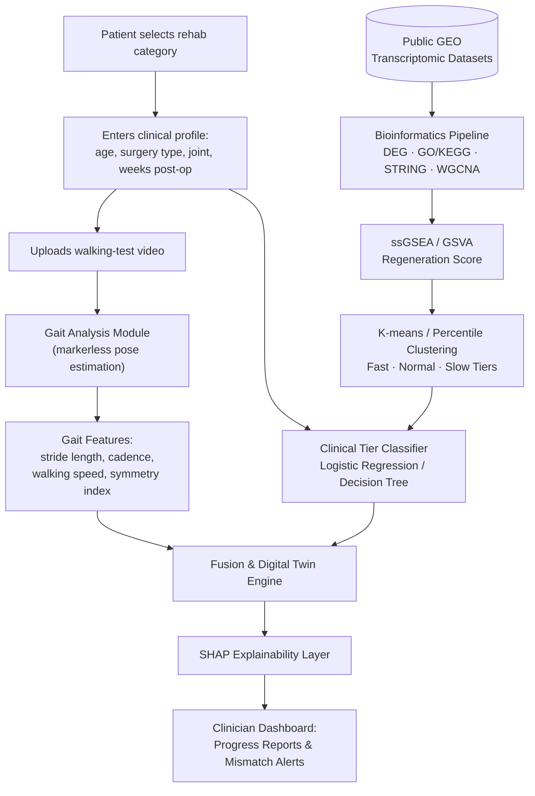

# BioRehab‑Twin

**A Bioinformatics‑Driven Digital Twin for Personalized Musculoskeletal / Lower‑Limb Rehabilitation**

> Bridging the gap between **how a patient moves** and **what is actually happening inside their tissues** — one explainable digital twin at a time.

---

## Table of Contents

- [The Problem](#the-problem)
- [Our Solution](#our-solution)
- [What Makes This Different](#what-makes-this-different)
- [System Architecture](#system-architecture)
- [How It Works](#how-it-works)
- [Scientific Foundation](#scientific-foundation)
- [Research Gap](#research-gap)
- [Research Objectives](#research-objectives)
- [Methodology](#methodology)
- [Tech & Methods Stack](#tech--methods-stack)
- [Target Users](#target-users)
- [Expected Outcomes](#expected-outcomes)
- [Scope & Limitations](#scope--limitations)
- [Team & Supervision](#team--supervision)
- [Selected References](#selected-references)
- [Contributing](#contributing)
- [License](#license)

---

## The Problem

Musculoskeletal disorders are among the leading global causes of pain and disability. Osteoarthritis (OA) alone — the largest single contributor to mobility-related disability — affected an estimated **595 million people worldwide in 2021** (GBD 2021 Study), including roughly **8.49 million people in Pakistan**. It is expected to keep rising with an aging, more sedentary global population.

OA was traditionally viewed as simple cartilage wear-and-tear. It is now understood as a **whole-joint disease** involving cartilage, subchondral bone, synovium, ligaments, muscle, and inflammatory signaling — and it frequently coexists with sarcopenia, creating a compounding cycle of muscle weakness and joint degeneration.

Diagnosis today relies heavily on radiographic imaging, MRI, and clinical exams — tools that typically only confirm damage **after** it has already occurred. Between hospital visits, patients recovering from joint replacement, OA, or lower-limb injury are monitored almost entirely through subjective pain scores and infrequent clinical observation. Two patients can look identical on a walking test while one is quietly healing well and the other is not healing at all — and no current rehabilitation tool can tell them apart.

## Our Solution

**BioRehab-Twin** is a personalized rehabilitation platform that fuses **bioinformatics**, **gait biomechanics**, and **explainable AI** into a single, continuously updated Digital Twin of a patient's recovery.

Instead of asking a patient to travel to a lab for motion-capture or undergo genetic sequencing, BioRehab-Twin:

1. Analyzes **publicly available population-level transcriptomic data** (GEO) to learn what "fast," "normal," and "slow" biological healing look like at the molecular level.
2. Learns to **predict which biological recovery tier a new patient most likely belongs to**, using only their clinical profile (age, surgery type, joint, weeks post-op) — no sequencing required.
3. Captures the patient's **actual functional recovery** via a simple smartphone walking-test video (stride length, cadence, symmetry, walking speed).
4. Fuses both signals into a Digital Twin, and uses **SHAP explainability** to flag and explain any mismatch between "how the patient is moving" and "how their tissue is likely healing."

## What Makes This Different

Across the reviewed literature, one pattern repeats: **bioinformatics research and gait/biomechanics research do not talk to each other.**

- Bioinformatics studies (hub-gene screens, Mendelian randomization, multi-omics panels) identify genes and pathways driving OA and recovery — but never connect these discoveries to how a patient actually moves.
- Gait and wearable-sensor studies accurately quantify stride length, cadence, and symmetry — but carry no biological signal, so they can say a patient is recovering *slowly*, never *why*.
- Existing musculoskeletal digital twins are overwhelmingly biomechanical or imaging-based; the integration of population-level biological/transcriptomic signal into a digital twin has been explicitly flagged in the literature as an open problem.

BioRehab-Twin is designed specifically to close that gap — using population-level biology as the *evidence base*, and routine clinical + gait data as the *only inputs a real patient ever has to provide*.

## System Architecture

## How It Works

| Step | Action |
|---|---|
| 1 | Patient selects their rehabilitation category (OA, post-arthroplasty, lower-limb injury, fall risk, etc.) |
| 2 | Patient enters their clinical profile (age, surgery/injury type, joint, weeks post-op) |
| 3 | Patient uploads a short walking-test video |
| 4 | AI performs markerless gait analysis on the video |
| 5 | The bioinformatics module estimates the patient's likely biological regeneration tier from clinical data alone |
| 6 | A fusion model combines both signals into a personalized Digital Twin |
| 7 | Progress reports, trend predictions, and mismatch alerts are surfaced on a clinician dashboard, with SHAP-based explanations |

## Scientific Foundation

**Disease biology.** Multi-layer molecular profiling (DNA methylation, RNA, and protein) of the same OA patients shows a consistent chondrocyte shift from a healthy, matrix-maintaining state into a destructive, catabolic one — driven predominantly by pathways in extracellular matrix organization, collagen degradation, and angiogenesis, not primarily inflammation as long assumed. This is why "recovery" in this project is treated as a molecular process (degeneration -> inflammation -> regeneration -> remodeling -> functional recovery), not just a return to normal walking.

**Differential expression as the core statistical model.** The bioinformatics pipeline follows the standard, well-validated workflow used across the reviewed literature: differential gene expression analysis (limma / DESeq2 / edgeR with FDR correction) -> GO/KEGG functional enrichment -> PPI network and WGCNA hub-gene analysis -> Mendelian randomization to separate genes that merely correlate with OA from genes that plausibly *cause* it (e.g., JUN and IL6 have been shown to have causal links to knee OA, unlike some other candidate genes).

**From population gene signatures to patient-level tiers.** This is the core original contribution of the project. Since real patients in this system will never be sequenced, a two-stage pipeline converts population-level biology into an individually usable prediction:
- **Stage 1:** GEO samples with paired gene expression + clinical metadata are scored (ssGSEA/GSVA) into a single "regeneration score" per sample, then clustered into Fast/Normal/Slow recovery tiers.
- **Stage 2:** A lightweight classifier (logistic regression / decision tree) is trained to predict tier membership using *only* clinical variables — age, surgery type, joint, weeks post-op — with no gene expression input at inference time. Biological truth comes from public omics data; the actual patient-facing input is purely clinical.

**Gait analysis.** Standard biomechanical parameters — stride length, cadence, walking speed, swing time, joint range of motion, and a Symmetry Index between affected and healthy limbs — are extracted via wearable sensors or markerless smartphone-video pose estimation, a lower-cost alternative to lab-based motion capture (e.g., VICON). Factor analysis is used to reduce redundancy among highly correlated gait parameters.

**Digital twin & explainability.** The system follows the standard digital-twin architecture (physical object, virtual replica, and a real-time connection between the two), positioned at the **semi-dynamic** maturity level (intermittent updates) — consistent with the fact that no fully real-time, closed-loop orthopedic digital twin has yet been reported in the literature. Because clinicians do not trust black-box predictions, SHAP plots paired with natural-language explanations are used to make every model output interpretable.

## Research Gap

> There is no existing platform that uses population-level biological recovery evidence as a benchmark against which a patient's real-time functional (gait) data is evaluated.

Bioinformatics and gait/biomechanics research exist — separately. The problem is not "AI in rehab" or "bioinformatics for OA"; both are mature fields on their own. The gap is the *missing bridge* between population-scale biological knowledge and individual, real-time functional monitoring.

## Research Objectives

1. Mine existing public transcriptomic data (e.g., GEO) with paired clinical metadata to identify recovery-relevant genes and pathways for knee and hip OA and joint-replacement recovery.
2. Translate population-level findings into regeneration scores (ssGSEA/GSVA) and cluster them into clinical recovery tiers (Fast / Normal / Slow).
3. Develop and validate a purely clinical classification model that predicts a patient's recovery tier from demographics and surgical information alone — with no patient-specific sequencing.
4. Build a gait analysis tool using smartphone or wearable video to quantify spatiotemporal gait parameters (stride length, cadence, symmetry index).
5. Fuse the predicted biological tier with gait data into a single explainable digital twin that flags biology–function mismatches, with SHAP-based interpretability.

## Methodology

A six-stage pipeline combining population-level bioinformatics with individual gait analysis:

1. **Gene & biomarker panel curation** — differential expression, PPI/hub-gene analysis (STRING, WGCNA), and Mendelian randomization for causal validation, built from existing literature.
2. **Data acquisition** — matched transcriptomic and clinical data collected and prepared from GEO.
3. **Regeneration scoring** — ssGSEA/GSVA reduces each sample's gene panel to a single regeneration score, clustered into Fast/Normal/Slow tiers via k-means or percentile cutoffs.
4. **Clinical tier classifier** — a logistic regression or decision tree model trained to predict tier from clinical variables alone (age, surgery type, joint, weeks post-op).
5. **Gait module** — spatiotemporal gait parameters extracted via smartphone-based markerless pose estimation or wearable IMUs, in parallel with Stage 4.
6. **Digital twin fusion** — predicted biological tier and real gait data combined; SHAP-based explanations surface mismatches between predicted biological recovery and observed functional recovery for clinician review.

## Tech & Methods Stack

| Domain | Methods / Tools |
|---|---|
| **Bioinformatics** (major) | GEO mining, DESeq2 / limma / edgeR, GO & KEGG enrichment, STRING & Cytoscape, WGCNA, Mendelian randomization, ssGSEA / GSVA, k-means clustering |
| **Clinical prediction** | Logistic regression, decision trees |
| **Biomechanics** (minor) | Smartphone markerless pose estimation, wearable IMU sensors, gait-cycle subphase analysis, Symmetry Index, factor analysis |
| **Explainable AI** | SHAP (SHapley Additive exPlanations) + natural-language explanation generation |
| **Software** | Patient-facing app, clinician dashboard, database, APIs, reporting layer *(planned)* |

## Target Users

- Post-orthopedic-surgery patients (knee/hip replacement)
- Osteoarthritis patients
- Older adults at risk of falls
- Patients recovering from lower-limb injuries
- Physiotherapists
- Orthopedic surgeons
- Rehabilitation clinics

## Expected Outcomes

- Continuous, low-cost rehabilitation monitoring between clinic visits
- Earlier detection of delayed or abnormal recovery
- Personalized rehabilitation support grounded in population-level biology
- Objective, explainable reports for clinicians rather than pain-score-only tracking
- A scalable architecture designed for extension to other lower-limb conditions

## Scope & Limitations

This Final Year Project validates the platform's approach specifically for **knee and hip osteoarthritis** and **post-knee/hip-replacement rehabilitation**. Please note:

- This is an **academic research prototype**, not a certified medical device, and is not intended for standalone clinical decision-making.
- No patient-specific gene sequencing is performed or required; biological tiers are inferred from population-level public data and each patient's clinical profile.
- The architecture targets a **semi-dynamic** digital twin (periodic updates from walking-test uploads), not a fully real-time closed-loop system.
- The current deliverable represents the literature review and system design stage; empirical validation (classifier performance, gait pipeline accuracy, clinical usability) is part of the ongoing FYP work described in the roadmap below.

## Team & Supervision

**Final Year Project — BS Bioinformatics**

| Role | Name |
|---|---|
| Team Member | Syeda Momina Assad |
| Team Member | Zainab Bilal |
| Team Member | Namra Basharat |
| Team Member | Ghania Munir |
| Supervisor | Dr. Zartasha Mustansar |

## Selected References

The project is grounded in a review of 40+ peer-reviewed sources spanning OA biomarkers, gait analysis, multi-omics, digital twins, and explainable clinical AI. A few key ones:

- GBD 2021 Osteoarthritis Collaborators, "Global, regional, and national burden of osteoarthritis, 1990–2021, with forecasts to 2050," *The Lancet Rheumatology*, 2025. doi: 10.1016/S2665-9913(25)00109-9
- J. Steinberg et al., "Integrative epigenomics, transcriptomics and proteomics of patient chondrocytes reveal genes and pathways involved in osteoarthritis," *Scientific Reports*, 2017. doi: 10.1038/s41598-017-09335-6
- L. Xu et al., "Identification of key hub genes in knee osteoarthritis through integrated bioinformatics analysis," *Scientific Reports*, 2024. doi: 10.1038/s41598-024-73188-z
- J. Kryczka et al., "A preliminary bioinformatic screen to identify SRI, SMC2, PSIP1, TLE4 and MSX1 as potential diagnostic and prognostic markers of osteoarthritis," *Scientific Reports*, 2025. doi: 10.1038/s41598-025-13575-2
- R. J. Boekesteijn et al., "Independent and sensitive gait parameters for objective evaluation in knee and hip osteoarthritis using wearable sensors," *BMC Musculoskeletal Disorders*, 2021. doi: 10.1186/s12891-021-04074-2
- J. Ma et al., "Mechanisms and precision interventions in sarcopenia and osteoarthritis comorbidity: A narrative review," *Journal of Orthopaedic Translation*, 2026. doi: 10.1016/j.jot.2026.101093
- P. Diniz et al., "Digital twin systems for musculoskeletal applications: A current concepts review," *Knee Surgery, Sports Traumatology, Arthroscopy*, 2025. doi: 10.1002/ksa.12627
- H. Wu, X. Tang, W. Wang, R. Li, "The AI-powered orthopedic digital twin: a new paradigm for personalized diagnosis, surgical simulation, and prognostic management," *Artificial Intelligence Surgery*, 2026. doi: 10.20517/ais.2026.37
- T. Sun et al., "The Digital Twin: A Potential Solution for the Personalized Diagnosis and Treatment of Musculoskeletal System Diseases," *Bioengineering*, 2023. doi: 10.3390/bioengineering10060627
- S. Hur et al., "Comparison of SHAP and clinician friendly explanations reveals effects on clinical decision behaviour," *npj Digital Medicine*, 2025. doi: 10.1038/s41746-025-01958-8

*Full bibliography (40+ sources) available in the project's literature review document.*

## Contributing

This is currently an academic Final Year Project. Suggestions, issues, and discussion are welcome — please open an issue to discuss before submitting a pull request once the codebase is live.

## License

License to be determined by the project team prior to public release.

---

<i>Built with bioinformatics, gait science, and explainable AI, for patients whose recovery deserves to be understood, not just observed.</i>

